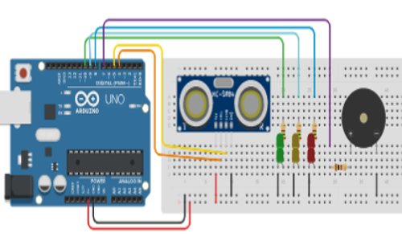
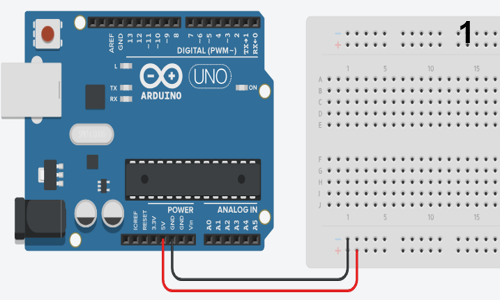
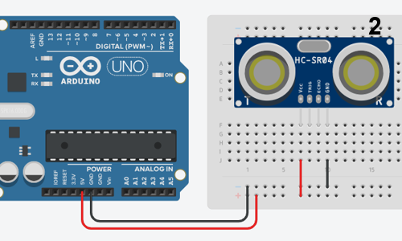
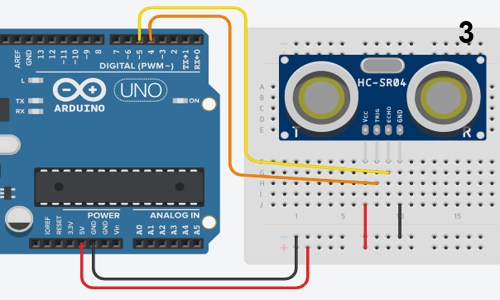
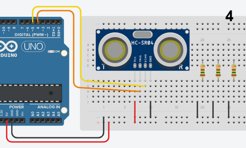
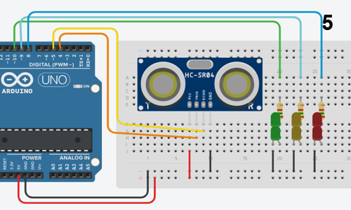
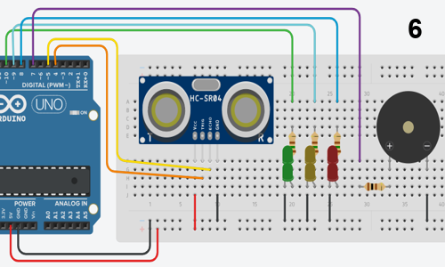
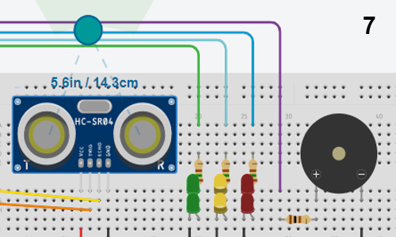
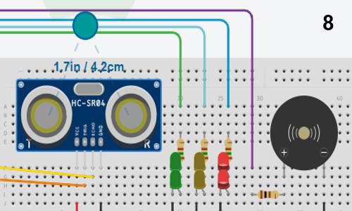
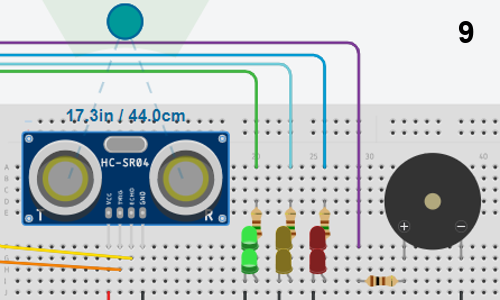

# Sensor de Ultrasonido N1

## Introducción:
En este proyecto, evaluaremos la funcionalidad de un sensor de ultrasonido con Arduino, examinando su comportamiento en diferentes distancias.

## Materiales:
- Resistencias (3 de 150 ohm, 1 de 100 ohm)
- Sensor HC-SR04 (ultrasonido)
- LEDs (2 verdes, 2 rojos, 2 amarillos)
- Buzzer
- Cables
- Protoboard
- Arduino Uno

## Resumen del Proyecto:
El proyecto, basado en Arduino Uno, integra LEDs verdes, amarillos y rojos, y un zumbador. Los LEDs verdes permanecen encendidos sin detección de objetos. Cuando un objeto se acerca al sensor, los LEDs amarillos se encienden y los verdes se apagan. Si el objeto está demasiado cerca, los LEDs amarillos se apagan y los rojos se encienden, acompañados de una alarma audible.

## Repositorio en GitHub:
El repositorio del proyecto en GitHub ofrece una visión general de sus objetivos y funcionalidad. Además, se ha incluido una guía paso a paso para ensamblar el prototipo en la sección de "IMÁGENES", proporcionando ayuda visual para los usuarios. Además, el código de Arduino necesario se ha proporcionado en la sección de "CÓDIGO" para un acceso conveniente.

## Instrucciones de Montaje del Circuito:
A continuación se muestran los pasos para armar el circuito:

**Paso a paso el armado del circuito:**

**Funcionamiento del circuito:**

